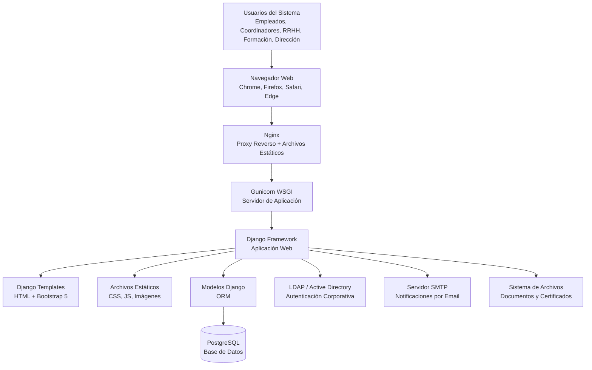
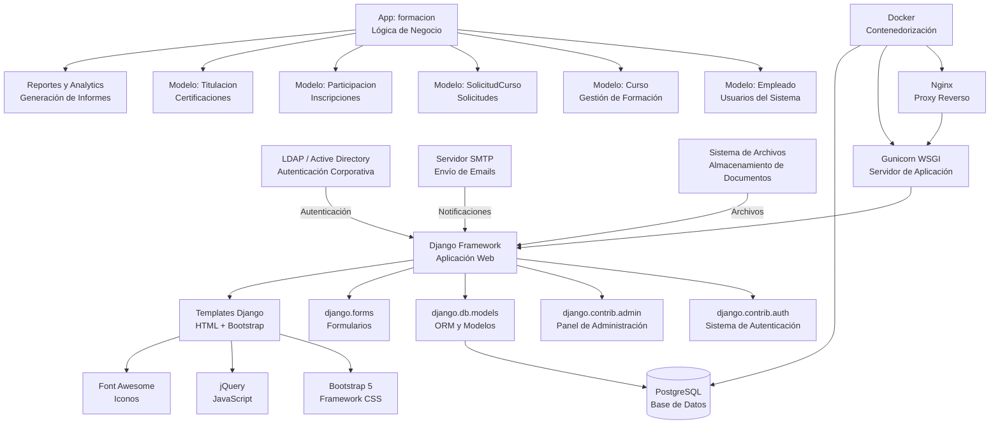
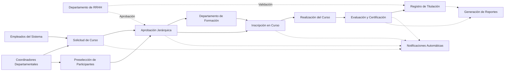
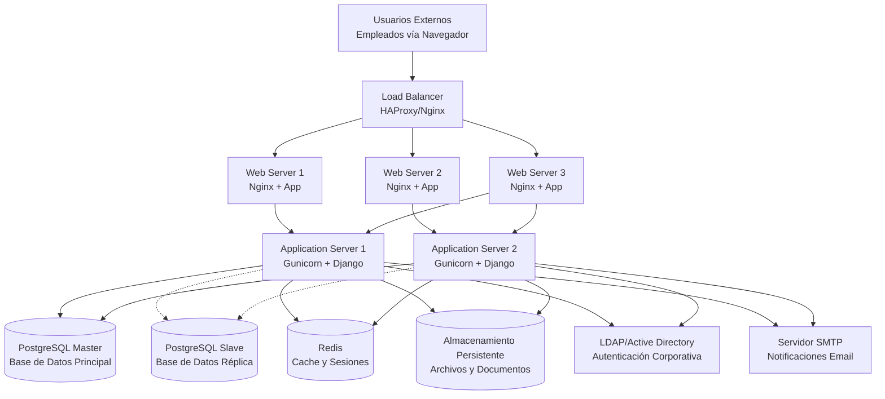

# Sistema de Gestión de Formación

## Descripción General

Este proyecto es un **Sistema de Gestión de Formación** desarrollado con **Django 5.2.3** que permite la administración integral de procesos formativos dentro de una organización. El sistema facilita la gestión de cursos, empleados, titulaciones, certificaciones y procesos de formación continua.

## Arquitectura del Sistema

### Tecnologías Principales

| Componente | Tecnología | Versión |
|------------|------------|---------|
| **Backend** | Python Django | 5.2.3 |
| **Base de Datos** | PostgreSQL | 17 |
| **Servidor Web** | Gunicorn + Nginx | - |
| **Contenedor** | Docker + Docker Compose | - |
| **Frontend** | HTML5, CSS3, Bootstrap | - |
| **Autenticación** | Django Auth con modelo personalizado + LDAP opcional | - |
| **Comunicaciones** | SMTP para notificaciones por email | - |
| **Análisis de Datos** | Pandas, NumPy para reportes | - |
| **Hojas de Cálculo** | OpenPyXL para importación/exportación Excel | - |

### Estructura del Proyecto

```
formacion_demo_casa/
├── formacion/                    # Aplicación principal Django
│   ├── models.py                # Modelos de datos
│   ├── views.py                 # Vistas y lógica de negocio
│   ├── urls.py                  # Configuración de rutas
│   ├── forms.py                 # Formularios Django
│   ├── admin.py                 # Configuración del admin
│   ├── templates/               # Plantillas HTML
│   ├── static/                  # Archivos estáticos (CSS, JS, imágenes)
│   └── migrations/              # Migraciones de base de datos
├── formacion_demo/              # Configuración del proyecto Django
│   ├── settings.py             # Configuración principal
│   ├── urls.py                 # Rutas principales
│   └── wsgi.py                 # Configuración WSGI
├── nginx/                      # Configuración del servidor web
├── docker-compose.yml          # Orquestación de contenedores
├── Dockerfile                  # Construcción de imagen Docker
├── requirements.txt            # Dependencias Python
└── README.md                   # Documentación básica
```

## Arquitectura Detallada del Sistema

### Tecnologías y Dependencias

#### Dependencias Externas
- **PostgreSQL 17**: Sistema de gestión de base de datos relacional
- **LDAP/Active Directory**: Autenticación corporativa opcional
- **Servidor SMTP**: Sistema de envío de notificaciones por email
- **Sistema de Archivos**: Almacenamiento de documentos y certificados

#### Dependencias Internas de Infraestructura
- **Docker + Docker Compose**: Contenedorización y orquestación
- **Nginx**: Servidor web y proxy reverso
- **Gunicorn**: Servidor WSGI para aplicaciones Python

#### Framework y Librerías
- **Django 5.2.3**: Framework web principal
- **Bootstrap 5**: Framework CSS para interfaz responsiva
- **Pandas + NumPy**: Análisis de datos para reportes
- **OpenPyXL**: Procesamiento de archivos Excel
- **python-decouple**: Gestión de configuración

### Diagramas de Arquitectura

#### Arquitectura General


#### Dependencias Internas vs Externas


#### Diagrama de Flujo de Datos


#### Diagrama de Infraestructura de Despliegue


## Funcionalidades Principales

### 1. Gestión de Usuarios y Roles

- **Modelo de Usuario Extendido**: Empleado personalizado con campos adicionales (DNI, sede, estado, etc.)
- **Sistema de Roles Jerárquico**: Empleado, Coordinador, RRHH, Formación, Dirección, Administrador
- **Permisos Basados en Grupos**: Control granular de acceso por funcionalidades
- **Coordinadores Departamentales**: Vinculación automática con departamentos y áreas
- **Estados de Empleado**: Activo, Baja, Baja médica, Vacaciones, Licencia
- **Puestos de Trabajo**: Sistema de puestos con códigos y descripciones

### 2. Gestión de Cursos

- **Creación y Edición Completa**: Formularios detallados con validación de datos
- **Modalidades Avanzadas**: Presencial, Online Síncrono, Online Asíncrono, Blended
- **Sistema de Proveedores**: Gestión completa de entidades externas con contacto
- **Control de Capacidad**: Plazas limitadas con gestión automática de disponibilidad
- **Estados de Ciclo de Vida**: Planificado, En Curso, Completado, Cancelado
- **Cursos Obligatorios**: Sistema de requisitos por puesto de trabajo
- **Tipos de Formación**: Onboarding, Refuerzo, Técnico, Idiomas, Habilidades Blandas, etc.
- **Resultados Formales**: Certificación MECES, Profesional Externa, Diploma Interno, Sin Reconocimiento

### 3. Gestión de Participaciones

- **Sistema de Inscripción Flexible**: Solicitudes directas y preselecciones por coordinadores
- **Estados Completos**: Pendiente, Confirmado, Asistido, Completado, Cancelado, Abandonado, Rechazado
- **Seguimiento Detallado**: Notas finales, certificados, fechas de inicio/fin reales
- **Validación Jerárquica**: Procesos de aprobación por RRHH, Formación y Dirección
- **Marcado Unificado**: Sistema inteligente de completado según tipo de resultado formal
- **Gestión de Plazas**: Control automático de disponibilidad y liberaciones

### 4. Gestión de Titulaciones

- **Auto-Servicio Completo**: Empleados pueden crear, editar y gestionar sus titulaciones
- **Sistema de Validación**: Proceso de aprobación/rechazo por RRHH con motivos detallados
- **Clasificación MECES**: Integración con Marco Español de Cualificaciones para Educación Superior
- **Tipos Completos**: Grado, Máster, Doctorado, FP Superior/Medio, Bachillerato, ESO, Idiomas, Cursos Especialización
- **Gestión de Documentos**: Subida segura de certificados y diplomas con validación de tipos
- **Niveles de Idioma**: Soporte para certificaciones de idiomas con niveles A1-C2

### 5. Sistema de Notificaciones

- **Notificaciones Contextuales**: Mensajes automáticos para cambios de estado y acciones
- **Tipos de Notificación**: Información, Éxito, Advertencia, Error con colores diferenciados
- **Enlaces de Acción**: URLs directas para completar tareas pendientes
- **Sistema Masivo**: Envío automático a múltiples usuarios según roles
- **Historial Completo**: Registro de todas las notificaciones con estado de lectura

### 6. Encuestas de Satisfacción

- **Sistema Completo de Evaluación**: Encuestas detalladas con múltiples preguntas sobre contenido, profesor y eficacia
- **Valoraciones Numéricas**: Escala de 1-5 para diferentes aspectos del curso
- **Comentarios Abiertos**: Campos de texto para sugerencias y observaciones
- **Análisis Estadístico**: Promedios y métricas de satisfacción por curso
- **Validación Automática**: Solo cursos completados pueden ser evaluados

### 7. Sistema de Preselección

- **Selección Prioritaria**: Coordinadores pueden preseleccionar empleados para cursos específicos
- **Sistema de Prioridades**: Asignación de prioridades (1-5) para ordenar preselecciones
- **Validación por RRHH/Formación**: Proceso de aprobación de preselecciones
- **Gestión Masiva**: Aprobación/rechazo de múltiples preselecciones simultáneamente
- **Notificaciones Automáticas**: Alertas a coordinadores y empleados sobre cambios

### 8. Solicitudes de Cursos

- **Sistema de Propuestas Detallado**: Coordinadores pueden solicitar cursos con justificación completa
- **Flujo de Aprobación Jerárquico**: Aprobación por Formación, RRHH y Dirección
- **Estados de Seguimiento**: Pendiente, Aprobada, Rechazada, En Proceso, Completada
- **Comentarios y Motivos**: Sistema de feedback detallado para rechazos
- **Notificaciones Automáticas**: Alertas a todos los interesados en cada cambio de estado
- **Conversión a Cursos**: Solicitudes aprobadas pueden convertirse automáticamente en cursos

### 9. Sistema de Reportes Avanzados

- **Dashboard Ejecutivo**: Panel con métricas, KPIs y visión global del estado de formación organizacional
- **Estadísticas de ITIL**: Seguimiento específico de certificaciones ITIL con porcentajes por departamento
- **Análisis de Satisfacción**: Promedios detallados de encuestas de satisfacción por curso y profesor
- **Métricas de Formación**: Horas promedio de formación por empleado, tasas de completitud
- **Gráficos Interactivos**: Visualizaciones con Chart.js para datos de formación
- **Filtros por Año**: Análisis histórico de datos de formación
- **Distribución por Departamentos**: Análisis de formación por áreas organizacionales

## Modelo de Datos

### Entidades Principales

1. **Empleado**: Usuario del sistema con información personal
2. **Departamento**: Estructura organizacional
3. **Área**: Subdivisión dentro de departamentos
4. **Puesto de Trabajo**: Posiciones laborales
5. **Curso**: Oferta formativa
6. **Participación**: Relación empleado-curso
7. **Titulación**: Certificaciones y títulos
8. **Proveedor**: Entidades externas que imparten formación
9. **SolicitudCurso**: Peticiones de nuevos cursos
10. **Notificación**: Mensajes del sistema
11. **Proyecto**: Iniciativas de formación
12. **Preseleccion**: Candidatos preseleccionados para cursos
13. **EncuestaSatisfaccion**: Evaluaciones de cursos completados
14. **RequisitoPuestoFormacion**: Requisitos formativos por puesto

### Relaciones Clave

- Un **Empleado** pertenece a un **Departamento** y **Área** específicos
- Un **Empleado** puede tener múltiples **Participaciones** en **Cursos**
- Un **Curso** puede tener múltiples **Participaciones** con control de plazas
- Una **Titulación** pertenece a un **Empleado** con validación por RRHH
- Un **Curso** puede tener un **Proveedor** externo o ser interno
- **Coordinadores** están vinculados a **Departamentos** específicos
- **Preselecciones** conectan **Empleados** con **Cursos** vía **Coordinadores**
- **Solicitudes de Curso** son creadas por **Coordinadores** y aprobadas jerárquicamente
- **Encuestas de Satisfacción** están vinculadas a **Participaciones** completadas

## Arquitectura de Seguridad

### Autenticación y Autorización

- **Autenticación**: Basada en Django Auth con soporte opcional para LDAP/Active Directory
- **Autenticación LDAP**: Integración con django-auth-ldap para autenticación contra servidores LDAP
- **Grupos de Usuarios**: Control de acceso por roles
- **Decoradores**: `@login_required`, `@user_passes_test`
- **Permisos**: Modelo de permisos de Django
- **Configuración Condicional**: Autenticación LDAP activable mediante variable de entorno

### Roles del Sistema

1. **Empleado**: Acceso básico, gestión propia
2. **Coordinador**: Gestión de equipo departamental
3. **RRHH**: Validación de certificados y empleados
4. **Formación**: Gestión de cursos y proveedores
5. **Dirección**: Visión global y aprobaciones
6. **Administrador**: Acceso completo al sistema

## Despliegue y Configuración

### Entorno de Desarrollo

- **Docker Compose**: Orquestación completa
- **PostgreSQL**: Base de datos relacional
- **Nginx**: Servidor web y proxy reverso
- **Gunicorn**: Servidor WSGI para Django

### Variables de Entorno

- **SECRET_KEY**: Clave secreta de Django
- **DEBUG**: Modo de desarrollo
- **DATABASE_URL**: Configuración de base de datos
- **EMAIL_***: Configuración de correo electrónico
- **LDAP**: Habilitar/deshabilitar autenticación LDAP
- **AUTH_LDAP_SERVER_URI**: URI del servidor LDAP
- **LDAP_BIND_DN**: Plantilla DN para usuarios LDAP

## API y Endpoints

### URLs Principales

- `/formacion/` - Dashboard principal
- `/formacion/login/` - Inicio de sesión
- `/formacion/mis-cursos/` - Cursos del usuario
- `/formacion/gestion-cursos/` - Gestión de cursos (RRHH/Formación)
- `/formacion/empleados/` - Lista de empleados
- `/formacion/notificaciones/` - Centro de notificaciones

### Vistas Clave

- **DashboardView**: Panel principal con métricas
- **MisCursosView**: Cursos del empleado actual
- **EmpleadosConFormacionView**: Gestión de empleados
- **EstadoCursosView**: Estado general de cursos
- **GestionCursosListView**: Lista de gestión de cursos

## Próximos Pasos

Para continuar con la documentación detallada, consulte los siguientes archivos:

- [DOCUMENTACION_API.md](DOCUMENTACION_API.md) - Detalles técnicos de modelos y vistas
- [GUIA_INSTALACION.md](GUIA_INSTALACION.md) - Guía completa de instalación y despliegue
- [GUIA_USUARIO.md](GUIA_USUARIO.md) - Manual de usuario final

---

**Versión**: 1.5
**Última actualización**: 2025-10-09
**Autor**: Sistema de Documentación Automática

---

## 📋 Resumen Ejecutivo de Arquitectura

La aplicación de **Sistema de Gestión de Formación** es una solución Django completa y escalable que integra múltiples tecnologías para ofrecer una plataforma robusta de gestión formativa empresarial.

### 🏗️ Arquitectura Técnica
- **Framework Principal**: Django 5.2.3 con arquitectura MVT
- **Base de Datos**: PostgreSQL 17 con soporte de réplicas
- **Servidor Web**: Nginx + Gunicorn en configuración de alta disponibilidad
- **Contenedorización**: Docker con orquestación completa
- **Frontend**: Bootstrap 5 con diseño responsivo y accesible

### 🔗 Integraciones Externas
- **LDAP/Active Directory**: Autenticación corporativa opcional
- **Servidor SMTP**: Sistema de notificaciones por email
- **Sistema de Archivos**: Almacenamiento seguro de documentos
- **API de Reportes**: Integración con herramientas de análisis

### 🛡️ Características de Seguridad
- **Autenticación Multi-método**: Django Auth + LDAP opcional
- **Autorización Basada en Roles**: 6 niveles jerárquicos de acceso
- **Validación de Datos**: Formularios con sanitización completa
- **Configuración Segura**: Variables de entorno y secretos

### 📊 Capacidades Funcionales
- **Gestión Completa de Formación**: Desde solicitud hasta certificación
- **Sistema Multi-rol**: Empleados, coordinadores, RRHH, formación, dirección
- **Reportes Avanzados**: Analytics con Pandas/NumPy
- **Notificaciones Inteligentes**: Sistema de eventos y alertas
- **Encuestas de Satisfacción**: Evaluación automática de cursos

Esta arquitectura proporciona una base sólida para la gestión integral de procesos formativos en entornos empresariales, con capacidad de escalado horizontal y alta disponibilidad.